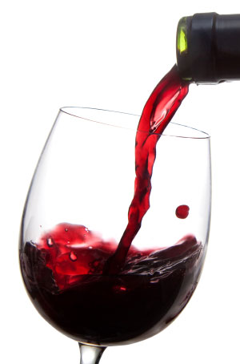

# The Perfect Pour

A Python-based wine recommender system that uses 3 different data sources to obtain user ratings on wines (i.e. scores and comments) along with wine attribute data (such as wine name, vintage, primary grape varietal, region/appellation and price). Different ML recommendation engines were generated through the use of item-user similarity models and numerous matrix factorization models. The models were built and evaluated by using the GraphLab Create machine learning framework.

Phase Two of the project will involve enhancing the recommender through the use of Google's Natural Language APIs to extract text comments from the user wine reviews and perform sentiment analysis.  The hope is that this will further enhance the quality of the recommendations.

## Repo Directories:

1. <b>scrapers:</b>  contains the different scripts that were used for scraping the target web-sites. Primary tools used included:  Selenium, Tor and Beautiful Soup.

2. <b>clean_eda:</b>  contains scripts used for data cleaning and analysis.  Primary tools used included:  Pandas, Regex and Matplotlib.

3. <b>recommenders:</b>  contains scripts used for generating the different recommendation models. Primary tools used included:  GraphLab Create.

4. <b>sentiment_analysis:</b>  contains scripts used for performing sentiment analysis. Primary tools used included:  Watson Alchemy Sentiment Analysis API.

## Project Presentation
The Perfect Pour Overview PDF file contains charts that provide a short overview of the project.
