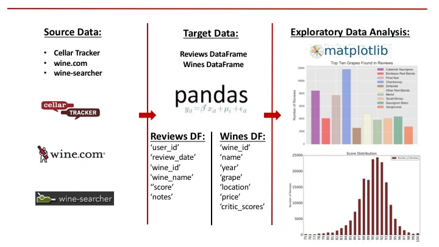

# Data Pipeline - Phase Two:  ETL and EDA

The second step in the data pipeline involved extracting and cleaning the data from the three different sources and then loading the data into two pandas dataframes:

1. <b>Reviews DataFrame:</b>  211,452 reviews

2. <b>Wines DataFrame:</b>  78.044 wines

 
Exploratory data analysis and visualization was conducted on the two dataframes to understand key characteristics of the data and for purposes of identifying outliers, incorrect data and missing data.
