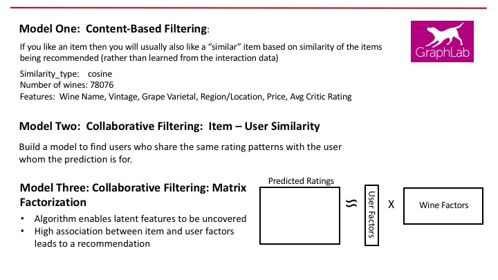

# Data Pipeline - Phase Three:  Process Data

The final step in the data pipeline was to use machine learning models to create a various recommendation engines, that would be able to recommend new wines to a user based upon how they previously had rated wines.  The GraphLab machine learning framework was used to build and evaluate the following recommendation models:

1. <b>Content-based Filtering</b>  item similarity

2. <b>Collaborative Filtering:</b>  item-user similarity

3. <b>Collaborative Filtering:</b>  matrix factorization (latent feature discovery)
 
