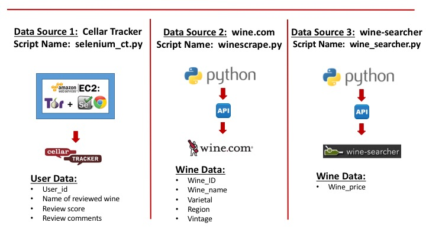

# Data Pipeline - Phase One:  Data Acquisition

The first phase of the data ingestion pipeline consisted of obtaining the needed data through the process of both web scraping and through direct API calls to http based resources.  This was performed through various Python scripts.

The data sources were three public web-sites:

1. <b>Cellar Tracker:</b>  Data obtained:  user reviews on wines (both the score, if available, and any comments about the wine. Methods used:  web-scraping using Selenium, Tor and pandas. Script used:  selenium_ct.py

2. <b>wine.com:</b>  Data obtained: wine data on over 70,000 wines. Methods used:  REST API calls. Script used:  winescrape.py.py

3. <b>wine-searcher.com:</b>  Data obtained:  prices on the wines. Methods used:  REST API calls. Script used:  wine_searcher.py
